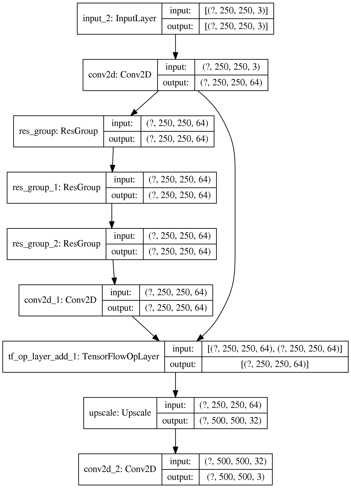

# RCAN
This is the implementation of an ECCV'18 paper, 'Image Super-Resolution Using Very Deep Residual channel Attention Networks' in Tensorflow [(link)](https://openaccess.thecvf.com/content_ECCV_2018/papers/Yulun_Zhang_Image_Super-Resolution_Using_ECCV_2018_paper.pdf).

For this implementation, I designed new layers and a model by subclassing, which was a good practice of this tensorflow code guide on 'Making new Layers and Models via subclassing'. [(link)](https://www.tensorflow.org/guide/keras/custom_layers_and_models)

## Prerequisite
- Language: Python3
- Required Packages: numpy, cv2 (for read image input), and tensorflow
- To install the required packages, type the following command:

1) Using tensorflow-gpu==2.0.0
```
pip3 install numpy opencv-python tensorflow-gpu==2.0.0
```

2) Using higher version of tensorflow
```
pip3 install numpy opencv-python tensorflow
```

## How to use the RCAN model
By subclassing layers and models, we can easily design RCAN model simply specifying a few parameters. 
- Parameters for CARN model:
1) initial_num_filters: represents the number of filters for the inital convolution layer
2) num_group: represents the ResGroup
3) num_block: represents the number of resnet blocks in a ResGroup
4) kernel_size: represents the number of convolution layer in a resnet block
5) scale_factor: represnets the scale factor in a resnet block
6) up_scale_factor: represents the upscale factor
7) reduction_rate: represents the reduction rate in a channel attention block
8) squeeze_factor: represent the channel squeeze factor in a upsample block

- How to create the RCAN model 
```
#DEFINE THE PARAMETERS
initial_num_filters = 64
num_group = 3
num_block = 3
kernel_size = 3
scale_factor = 0.1
up_scale_factor = 2
reduction_rate = 3
squeeze_factor = 2

#LOAD THE LOW RESOLUTION AND HIGH RESOLUTION IMAGE DATA SETS
data = cv2.imread('img.jpg').astype(float)
small_data = cv2.resize(data, None, fx = 1/up_scale_factor, fy = 1/up_scale_factor)

#CREATE AN RCAN MODEL
model = RCAN(initial_num_filters, num_group, num_block, kernel_size, scale_factor, up_scale_factor, reduction_rate, squeeze_factor)

optimizer = tf.keras.optimizers.Adam(learning_rate = 1e-4)
model.compile(optimizer = optimizer, loss = tf.keras.losses.MeanAbsoluteError())

#TRAIN
model.fit(small_data[np.newaxis, ...], data[np.newaxis, ...], epochs = 100)
model.build_graph().summary()
tf.keras.utils.plot_model(model.build_graph(), show_shapes=True, dpi=256)

#PREDICTION
result = model.predict(small_data[np.newaxis, ...])
result = tf.cast(result, tf.uint8)

cv2.imshow('img', tf.squeeze(result).numpy())
cv2.waitKey(0)
'''
```

- Model Structure



